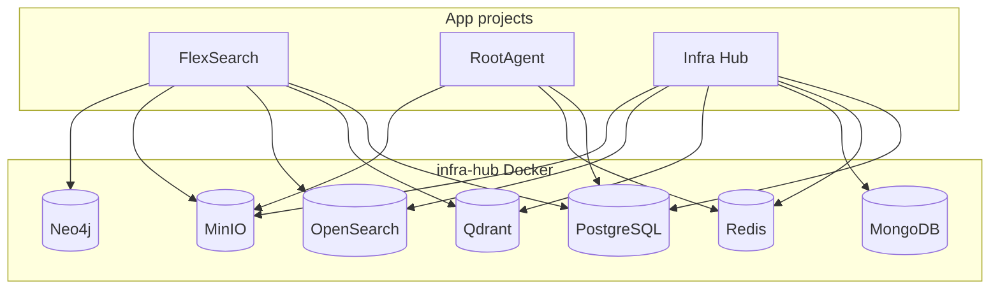

# Infra Hub

Centralized infrastructure platform for running shared Docker services once and reusing them across projects (FlexSearch, RootAgent, and others).

## What this project does

- Runs core services in Docker (`postgres`, `redis`, `mongodb`, `qdrant`, `opensearch`, `minio`, `neo4j`) with persistent volumes
- Exposes service/admin status and control via FastAPI backend
- Provides a React dashboard frontend with env-driven admin URLs (no hardcoded `localhost`)
- Keeps service URLs, container names, and ports environment-driven through `backend/config.py`
- Uses the breaking `/api/v2` interface exclusively; v1 routes do not exist

## Architecture

- **Frontend**: React + Vite (`frontend/`)
- **Backend**: FastAPI (`backend/`)
- **Infra**: Docker Compose (`docker-compose.yml`)

Frontend calls `'/api/v2'` only:

- **Local dev**: Vite proxies `/api/v2` to the backend target from `VITE_DEV_API_TARGET`
- **Deployment**: proxy `/api/v2` to the backend service

## Environment files

- `backend/.env` — **single source of truth** for Docker Compose ports/credentials, backend app port, CORS, `SERVICE_PUBLIC_HOST`, admin URLs, and `INFRA_PERSIST_DIR`
- `frontend/.env` — frontend dev port and local proxy target

Docker Compose reads `backend/.env` via `docker compose --env-file backend/.env` (all `make up`, `make down`, etc. do this automatically).

Persistent service data (Postgres, Redis, MinIO, …) is bind-mounted under `INFRA_PERSIST_DIR` (default `~/.local/share/projects/infra-hub/volumes`), not under the repo. Dev logs live under `~/.local/share/projects/infra-hub/dev-logs`. Docker images/containers themselves already live in Docker’s data root (e.g. `/var/lib/docker`), not in the project tree.

- **Host ports** (e.g. `POSTGRES_PORT=54321`, `REDIS_PORT=63791`) — what you connect to from your machine
- **Internal ports** (e.g. `MINIO_INTERNAL_CONSOLE_PORT=9001`) — ports inside the container; used in commands, healthchecks, and `host:container` mappings. Change these only when you remap both sides together.

If you run Compose directly:

```bash
docker compose --env-file backend/.env up -d
```

Templates:

- `backend/.env.example`
- `frontend/.env.example`

## Quick start

### 1. Install dependencies

```bash
make install
```

### 2. Start full local development (infra in Docker + apps locally)

```bash
make dev-local
```

Run local development as your normal user, not with `sudo`. Configure Docker
access for that user; elevating the entire Make command can leave project files
and persistent data owned by root.

Logs are written to `~/.local/share/projects/infra-hub/dev-logs/`:

```bash
tail -f ~/.local/share/projects/infra-hub/dev-logs/backend.log ~/.local/share/projects/infra-hub/dev-logs/frontend.log
```

### 3. Run infra services in Docker only

```bash
make dev
```

After `make up` or `make dev-local`, print app and admin URLs:

```bash
make print-urls
```

## Runtime URLs (env-driven)

Default local values are controlled by env in `backend/.env`:

| Purpose | URL pattern |
|--------|-------------|
| Frontend | `http://<SERVICE_PUBLIC_HOST>:<VITE_PORT>` |
| Backend API | `http://<SERVICE_PUBLIC_HOST>:<API_PORT>` |
| API docs | `http://<SERVICE_PUBLIC_HOST>:<API_PORT>/api/v2/docs` |
| Infra Hub login | `ADMIN_EMAIL` / `ADMIN_PASSWORD` in `backend/.env` |

Admin UI links in the dashboard are built from `SERVICE_PUBLIC_HOST` and per-service port envs (see table below).

## Infra services overview

| Service | Container | Host port (typical) | Use when |
|---------|-----------|---------------------|----------|
| PostgreSQL | `infra-postgres` | `54321` | Structured data: users, metadata, transactions |
| Redis | `infra-redis` | `63791` | Cache, sessions, pub/sub, rate limits |
| MongoDB | `infra-mongodb` | `27018` | Flexible JSON documents, logs, configs |
| Qdrant | `infra-qdrant` | `6333` (REST), `6334` (gRPC) | Vector embeddings, semantic / hybrid search, RAG |
| OpenSearch | `infra-opensearch` | `9200` (HTTP) | Full-text (BM25), autocomplete, aggregations, k-NN |
| MinIO | `infra-minio` | `9000` (API), `9001` (console) | S3-compatible object storage |
| Neo4j | `infra-neo4j` | `7474` (Browser), `7687` (Bolt) | Knowledge graphs, Graph RAG |

App projects connect to these via host ports on `127.0.0.1` (or `SERVICE_PUBLIC_HOST`) using credentials from their own `.env` files, which should match infra-hub `backend/.env`.

## Admin UIs

All admin URLs use `SERVICE_PUBLIC_HOST` from `backend/.env` (default `127.0.0.1`). Credentials are read from `backend/.env` only — never commit real passwords; see `backend/.env.example` for the local template.

| Admin UI | URL (default local) | Port env | Login / access |
|----------|---------------------|----------|----------------|
| pgAdmin | `http://127.0.0.1:5050` | `PGADMIN_PORT` | `PGADMIN_EMAIL` / `PGADMIN_PASSWORD` |
| RedisInsight | `http://127.0.0.1:5540` | `REDISINSIGHT_PORT` | Preconfigured DB `infra-redis` (`redis:6379`, password `REDIS_PASSWORD`) |
| Mongo Express | `http://127.0.0.1:8081` | `MONGO_EXPRESS_PORT` | Basic auth disabled locally (`ME_CONFIG_BASICAUTH=false`) |
| Qdrant dashboard | `http://127.0.0.1:6333/dashboard` | `QDRANT_REST_PORT` | Enter `QDRANT_API_KEY` from `backend/.env` when set |
| OpenSearch Dashboards | `http://127.0.0.1:5601` | `OPENSEARCH_DASHBOARDS_PORT` | Local security plugin disabled (no login) |
| MinIO Console | `http://127.0.0.1:9001` | `MINIO_CONSOLE_PORT` | `MINIO_USER` / `MINIO_PASSWORD` |
| Neo4j Browser | `http://127.0.0.1:7474` | `NEO4J_HTTP_PORT` | `NEO4J_USER` / `NEO4J_PASSWORD` |

Service pages in the Infra Hub UI show an **Admin access** card with the same URL and login hints from the backend `get_info` API.

## How to use each service

### PostgreSQL (`infra-postgres`, port `54321`)

- **What**: Relational database for structured application data.
- **Admin**: pgAdmin at `http://<SERVICE_PUBLIC_HOST>:<PGADMIN_PORT>`.
- **Connect**: `postgresql://<POSTGRES_USER>:<POSTGRES_PASSWORD>@127.0.0.1:54321/<POSTGRES_DB>` (adjust user/password/db from `.env`).
- **Workflow**: Create per-app databases (e.g. `flexsearch`, `rootagent`); run Alembic or `init_db()` migrations from each app backend. Infra Hub stores its own users in PostgreSQL.

### Redis (`infra-redis`, port `63791`)

- **What**: In-memory cache, session store, pub/sub.
- **Admin**: RedisInsight at `http://<SERVICE_PUBLIC_HOST>:<REDISINSIGHT_PORT>` — connection alias `infra-redis` is pre-added via Docker env (`RI_REDIS_*`).
- **Connect**: `redis://:<REDIS_PASSWORD>@127.0.0.1:63791`
- **Workflow**: Inspect keys/TTL in RedisInsight or use Infra Hub Redis query API; apps use the same URL from their `.env`.

### MongoDB (`infra-mongodb`, port `27018`)

- **What**: Document database for JSON documents.
- **Admin**: Mongo Express at `http://<SERVICE_PUBLIC_HOST>:<MONGO_EXPRESS_PORT>` (no login in default local config).
- **Connect**: `mongodb://<MONGO_USER>:<MONGO_PASSWORD>@127.0.0.1:27018`
- **Workflow**: Browse/create databases and collections in Mongo Express or via Infra Hub MongoDB page.

### Qdrant (`infra-qdrant`, REST `6333`, gRPC `6334`)

- **What**: Vector database for embeddings and similarity search (also supports sparse/hybrid BM25-style retrieval).
- **Admin**: Dashboard at `http://<SERVICE_PUBLIC_HOST>:<QDRANT_REST_PORT>/dashboard`.
- **API key**: When `QDRANT_API_KEY` is set in `backend/.env`, the dashboard and REST API require that key (compose sets `QDRANT__SERVICE__API_KEY`). This is expected — paste the key from `.env` into the dashboard prompt.
- **Connect**: `QdrantClient` with `url` and `api_key` matching `.env`; FlexSearch/RootAgent use the same values.

### OpenSearch (`infra-opensearch`, HTTP `9200`; Dashboards `5601`)

- **What**: Search engine for BM25 full-text, autocomplete/suggesters, aggregations/facets, and k-NN vectors. Keep Qdrant for dedicated vector workloads; use OpenSearch when you need search UX features.
- **Admin**: OpenSearch Dashboards at `http://<SERVICE_PUBLIC_HOST>:<OPENSEARCH_DASHBOARDS_PORT>` (security plugin disabled locally).
- **Connect**: `http://127.0.0.1:9200` (or `SERVICE_PUBLIC_HOST` + `OPENSEARCH_HTTP_PORT`) with `opensearch-py` / OpenSearch clients.
- **Host note**: On Linux, OpenSearch may require `sudo sysctl -w vm.max_map_count=262144` (persist via `/etc/sysctl.conf`). Its data is bind-mounted at `INFRA_PERSIST_DIR/opensearch`.
- **Workflow**: Create indices per app; run Query DSL / Dev Tools in Dashboards; use Infra Hub OpenSearch page for list/search/knn/suggest actions.

### MinIO (`infra-minio`, API `9000`, console `9001`)

- **What**: S3-compatible object storage (files, PDFs, artifacts).
- **Admin**: Console at `http://<SERVICE_PUBLIC_HOST>:<MINIO_CONSOLE_PORT>` — login `MINIO_USER` / `MINIO_PASSWORD`.
- **Connect**: S3 endpoint `http://127.0.0.1:9000` with same credentials; use boto3, minio-py, or the console.
- **Workflow**: Create buckets per app; upload/download via console, `mc` CLI, or SDKs. Compose sets `MINIO_SERVER_URL` and `MINIO_BROWSER_REDIRECT_URL` from `SERVICE_PUBLIC_HOST` so redirects work locally.

### Neo4j (`infra-neo4j`, Browser `7474`, Bolt `7687`)

- **What**: Property graph database for knowledge graphs and Graph RAG.
- **Admin**: Neo4j Browser at `http://<SERVICE_PUBLIC_HOST>:<NEO4J_HTTP_PORT>`.
- **Connect**: `bolt://<SERVICE_PUBLIC_HOST>:<NEO4J_BOLT_PORT>` with `NEO4J_USER` / `NEO4J_PASSWORD` from `.env`; FlexSearch Graph RAG uses the same values.
- **Workflow**: Explore graphs interactively in Neo4j Browser; active administrators can run privileged Cypher from the Infra Hub Neo4j page.

### How services fit your stack



## Important behavior

1. `make dev` runs infra services in Docker only.
2. `make dev-local` starts Docker infra services, waits for PostgreSQL, then runs backend/frontend locally.
3. Docs/login auth needs PostgreSQL reachable.
4. Backend returns `503` when the user database is unavailable (instead of misleading `401` loops).
5. After `make clean-hard`, run `make up` then `make dev-local` so containers and local processes are fresh.
6. All active database-provisioned users are equally privileged infrastructure administrators. There is no signup or user-management UI/API.
7. Stop actions stop containers (including configured admin companions); they do not remove images or persistent data.

## Make commands

```bash
make install      # uv sync + pnpm install
make up           # start all Docker services + print-urls
make down         # stop Docker services + local backend/frontend pids
make dev          # run infra services in Docker (alias: up)
make dev-local    # Docker infra + local backend/frontend
make wait-db      # wait for infra-postgres healthy (used by dev-local)
make print-urls   # backend, frontend, and admin UI URLs from .env
make logs         # docker compose logs -f
make ps           # docker compose ps
make health       # data services + admin UI health checks
make clean        # remove local caches and pid files
make clean-all    # clean + docker compose down -v
make clean-hard   # stop-local, down --volumes --rmi local, rm $$INFRA_PERSIST_DIR
```

Per-service compose shortcuts: `make up-postgres`, `make up-redis`, `make up-mongodb`, `make up-qdrant`, `make up-opensearch`, `make up-minio`, `make up-neo4j`.

## Troubleshooting

### After `clean-hard`

1. `make up` (or `make dev-local`)
2. Confirm `make health` — especially RedisInsight and MinIO console under **Admin UIs**
3. Log into Infra Hub with `ADMIN_EMAIL` / `ADMIN_PASSWORD` from `backend/.env`
4. If login returns **503**, a stale backend may still be bound to `API_PORT` — run `make stop-local` then `make dev-local` again

### pgAdmin does not open or times out

- Often caused by pgAdmin permission errors after `clean-hard` (container cannot write `/var/lib/pgadmin/sessions`)
- Compose uses the bind mount `INFRA_PERSIST_DIR/pgadmin` and fixes ownership on startup
- Recreate: `docker compose --env-file backend/.env up -d pgadmin --force-recreate`
- Login: `PGADMIN_EMAIL` / `PGADMIN_PASSWORD` from `backend/.env`
- Direct URL: `http://127.0.0.1:5050` (or your `PGADMIN_PORT`)

### RedisInsight restart loop or empty UI

- Compose uses the bind mount `INFRA_PERSIST_DIR/redisinsight`
- Health endpoint: `curl -sf http://127.0.0.1:5540/api/health/`
- Open RedisInsight and use the preconfigured `infra-redis` connection

### MinIO console blank or login fails

- Use `MINIO_USER` / `MINIO_PASSWORD` from `backend/.env` (password must be ≥ 8 characters)
- Ensure `MINIO_SERVER_URL` and `MINIO_BROWSER_REDIRECT_URL` match `SERVICE_PUBLIC_HOST` and ports (set in `docker-compose.yml`)
- Open console via `make print-urls`, not a stale bookmark to `localhost` if you changed `SERVICE_PUBLIC_HOST`

### Qdrant dashboard asks for API key

- Expected when `QDRANT_API_KEY` is set in `backend/.env`
- Copy that value into the dashboard API key field (same key apps use in `QdrantClient`)

### OpenSearch fails to start / max virtual memory areas

- Symptom: container exits with `max virtual memory areas vm.max_map_count [65530] is too low`
- Fix: `sudo sysctl -w vm.max_map_count=262144` and add `vm.max_map_count=262144` to `/etc/sysctl.conf`
- Then: `make up-opensearch` (or `make up`)

### Stale data after reset

- `docker compose down -v` alone may not clear bind-mounted data under `INFRA_PERSIST_DIR` (default `~/.local/share/projects/infra-hub/volumes`); `make clean-hard` removes that directory explicitly

## Reverse proxy note (Nginx)

Use one domain and proxy:

- `/` → frontend
- `/api/v2` → backend

Host-only mode intentionally rejects non-loopback binds. If a reverse proxy is used, keep the backend and services bound to loopback and proxy only the relative `/api/v2` interface.

## Further reading

- Backend port/env reference: [`backend/README.md`](backend/README.md)
- Breaking upgrade and recovery procedure: [`docs/V2_UPGRADE.md`](docs/V2_UPGRADE.md)
- Original project vision (unchanged): [`infra-hub.md`](infra-hub.md)
